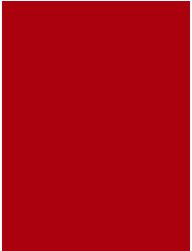
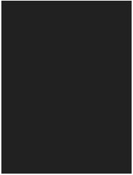
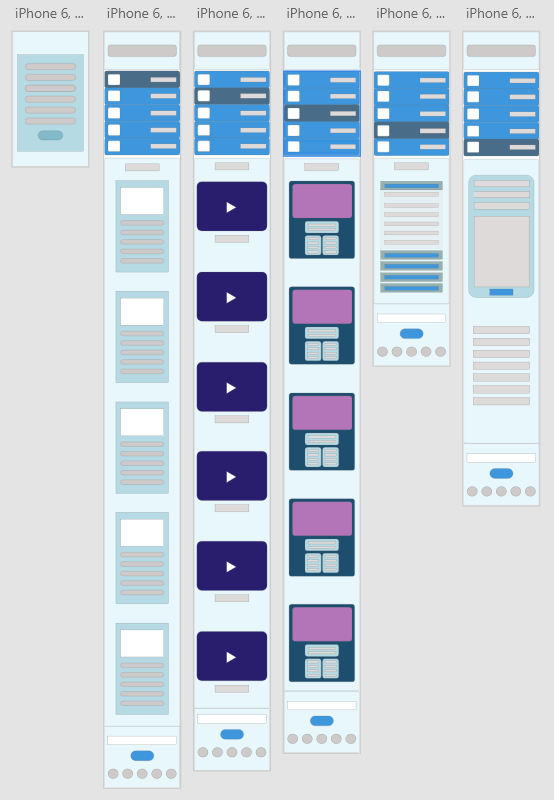
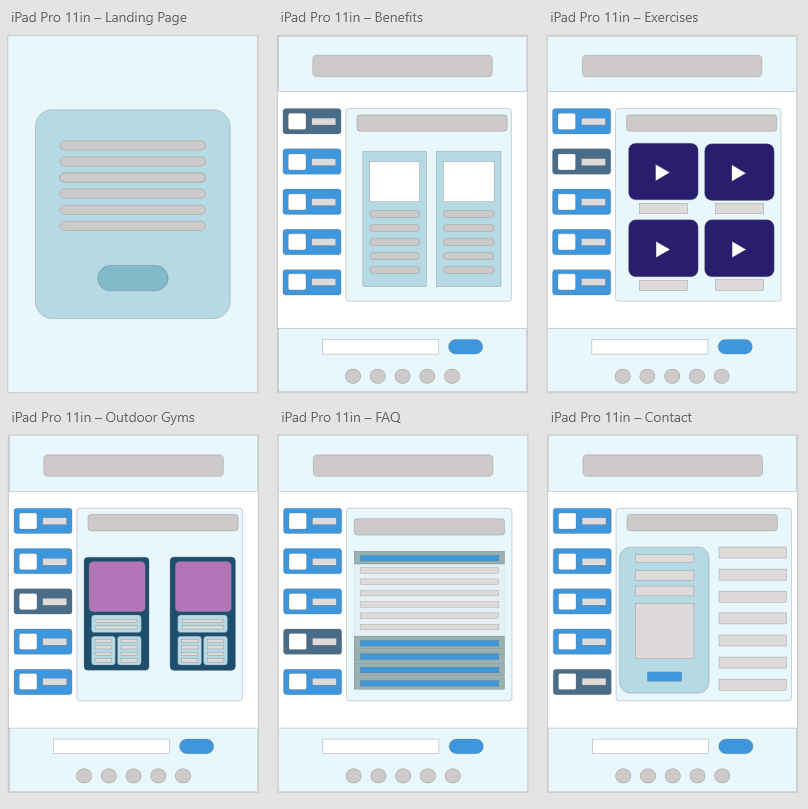
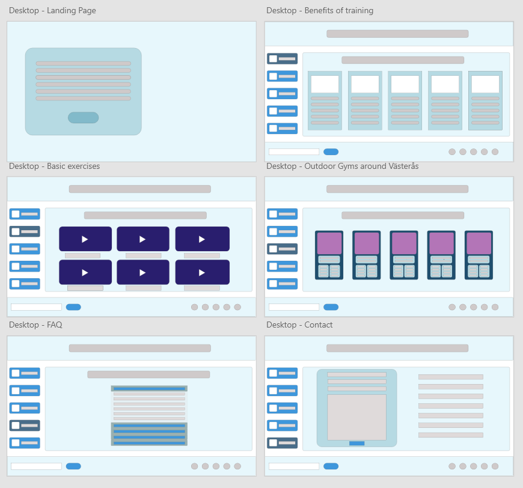
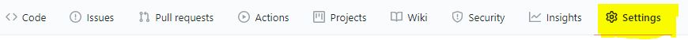
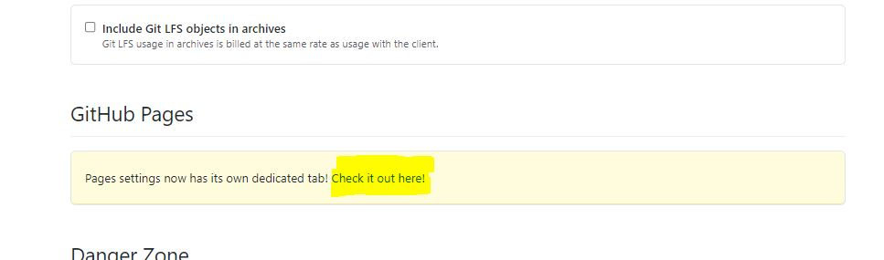
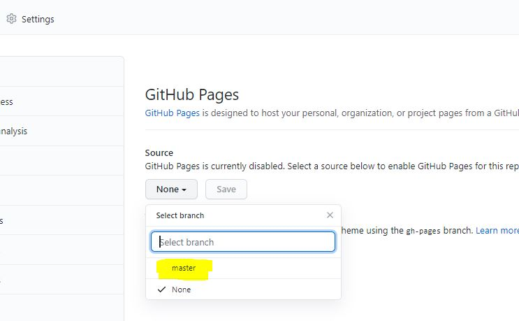
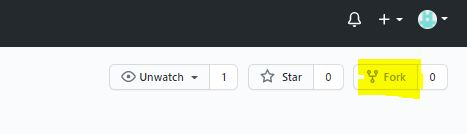
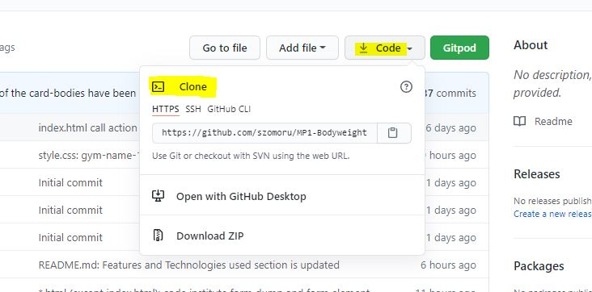

<h1 align="center">Use Your Body</h1>
<h1 align="center"></h1>

:point_right: <a href="http://szomoru.github.io/MP1-Bodyweight/">Live Website</a> :point_left:

:point_right: <a href="https://github.com/szomoru/MP1-Bodyweight">Github Repository</a> :point_left:
 
 ## About

There are tons of workout programs and personal trainers on the net, but there are still people who are struggling how start to work on a better themself. Sometimes people over mistify what they have to do and do not think about the simpliest, fastest solution. This website has been created to show those people that they do not need much to start to live a healthier life, specially when comes to the training. They do not need expensive gym subscription or personal trainers. They need just their Body. The goal of this website is to introduce the basic bodyweight exercises and answer some frequently asked questions. This website enjoyable on every device, so it is easy to acces in all circumstances.
 


## Table of Contents

[User Experience (UX)](#UX)

[Features](#features)

[Technologies Used](#technologies)

[Testing](#testing)

[Note about Commits](#commits)

[Deployment](#deployment)

[Credits](#credits)


<a name="UX"></a>

## User Experience (UX)

-   ### User stories

    -   #### First Time Visitor Goals

        1. As a First Time Visitor, I want to easily understand the content of the webpage and make a fast decision if the content interesting for me or not.
        2. As a First Time Visitor, I want to be able to easily navigate through the site and get an overal picture about the site structure very fast.
        3. As a First Time Visitor, I want to see their social media availability, where i can get more information about the site or organisation / person behind that.
        4. As a first Time Visitor i want to find the possibility how to get more information or notifications about future updates. 

    -   #### Returning Visitor Goals

        1. As a Returning Visitor, I want to find information about bodyweight exercises.
        2. As a Returning Visitor, I want to see a contact form where i can ask questions or share my thoughts and comments.
        3. As a Returning Visitor, I want to find community links.

    -   #### Frequent User Goals
        1. As a Frequent User, I want to see if there are more bodyweight exercises or maybe full training plans.
        2. As a Frequent User, I want to sign up to a Newsletter so never miss any updates or news about the website and the topic.

-   ### Design

    -   #### Colour Scheme
        -   The two main colours that were used are Red (Hex: #ab000d)  and Dark grey (Hex: #212121)  . The color combination was selected on the Material Design website (https://material.io/resources/color/#!/?view.left=0&view.right=0&primary.color=212121&secondary.color=F57F17)


    -   #### Typography
        -   The Graduate and Lato fonts are the main font used throughout the whole website with Sans Serif as the fallback font in case for any reason the font isn't being imported into the site correctly. Graduate font style shows strength so it fits perfectly for an active lifestyle promoting website. The Graduate font is used mainly for headings and text which was planned to be highlighted. Lato font style is a smoother style but looks good in pair with Graduate (checked on Google Font) and mainly used for general texts.
    
    -   #### Imagery
        -   Imagery is important. The large, background hero image was selected to show the visitor what this website is about. It makes clear the content of the website for the visitor without reading a word. With the black and white and shaded style it looks modern and powerfull.

*   ### Wireframes

    -   There were several design change during the development process, but the final site looks very familiar with the wirframe. 

    -   Mobile Wireframe - [View](./assets/wireframes/mobile_wireframe.pdf)

        


    -   Ipad Pro Wireframe - [View](./assets/wireframes/ipadpro_wireframe.pdf)

        


    -   Desktop Wireframe - [View](./assets/wireframes/desktop_wireframe.pdf)

        

    ## Features

    ### Present Features

    #### Features accross all Pages

    -   The website was designed to have the same structure on all pages. It is easy for the user to see through the website and very easy to navigate. 
        The layout is the following:
        - On the top section there is the Header
        - The middel section is divided into 2 parts:
            - Navigation on the Left (smaller screens on the Top)
            - Main content on the right (smaller screens on the Bottom)
        - The page is closed with the Footer 

    - [x] **Header**
        - The header contains only one element, what is the name of the site with link to the home page
        - By clicking on the text the visitor can return back to the home page from anywhere  

    - [x] **Main section**
        - [x] Navigation 
            - The right side of the Main section is the navigation
            - There are the navigation items vertically sorted
            - The menu items change color and became slightly highlighted if the visitor hover over the mouse
            - The connected menu point to the actual page is always highlighted so it is always visible for the visitor where she/he located in the strucutre
            - By clicking on a navigtion item it activates the conneted html page
        - [x] Main Section Content
            - Right side of the middle section
            - this window conatins the page specific information
    - [x] **Footer**
        - Always located as the last element of the page
        - Divided into the Social network area and the Sign up area
            - Social network area conatins icons, those represent the most popular social media platforms. These icons have live link to the represented social media platform
            - Sign up call to action to leave the e-mail address for future connections. The signup features right now pointed to the Code Instiotute form dumb 

    #### Features specific to Pages

    - [x] **Landing page**
        - Hero imnage set to the background, which clearly represents the type of the webpage
        - A smaller window floating over the background, which highlight some topic of the content od the page and call to action
        - If the visitor accept the invitation and take action after clicking the "Learn more" button, getss to the Home page.
    - [x] **Home page**
        - Home page is already designed for the previously described layout structure. 
        - At the main content window it contains a wikipedia article about Bodyweight training.
    - [x] **Benefits page**
        - Describe 5 benefits of bodyweight training in the main content section
    - [x] **Exercises page**
        - Contains gif cards. Each card introduces one bodyweight exercise
        - The layout of the cards are changing with the change of the viewport size (Responsive) 
    - [x] **Outdoor Gyms page**
        - Contains "map cards". Each card introduces a location of an Outdoor Gym or Inhouse Gym-
        - The layout of the cards are changing with the change of the viewport size (Responsive) 
    - [x] **Questions**
        - This page contains the most frequently asked questions about bodyweight training and give an answer to that
        - By clicking on the question button the answer became unfolded and it will be collapse if the visitor clicks on an other question 
    - [x] **Contact page**
        - Contains a contac form that the visitor can fill out to ask a question or share a story
        - The contant form is linked to Code Institute form dumb

    ### Future Features
    - Adding information about healthy food options and also diet options which can be very well combined with Bodyweight training
    - Adding ready made training plans with nutrition plans for different goals (fat burning, muscle building, healthy lifestyle) 


<a name="technologies"></a>

## Technologies Used

### Languages Used

-   [HTML5](https://en.wikipedia.org/wiki/HTML5)
-   [CSS3](https://en.wikipedia.org/wiki/Cascading_Style_Sheets)

### Frameworks, Libraries & Programs Used

1. [Bootstrap 4.1.3:](https://getbootstrap.com/docs/4.4/getting-started/introduction/)
    - Bootstrap was used to assist with the responsiveness and styling of the website.
1. [Hover.css:](https://ianlunn.github.io/Hover/)
    - Hover.css was used on the Social Media icons in the footer and on all cards and menu items to highlight and scale while being hovered over them.
1. [Google Fonts:](https://fonts.google.com/)
    - Google fonts were used to import the 'Graduate' and 'Lato' fonts into the style.css file which is used on all pages throughout the project.
1. [Font Awesome:](https://fontawesome.com/)
    - Font Awesome was used on all pages throughout the website to add icons for aesthetic and UX purposes.
1. [jQuery:](https://jquery.com/)
    - jQuery came with Bootstrap 
1. [Git](https://git-scm.com/)
    - Git was used for version control by utilizing the Gitpod terminal to commit to Git and Push to GitHub.
1. [GitHub:](https://github.com/)
    - GitHub is used to store the projects code after being pushed from Git.
1. [Adobe XD:](https://www.adobe.com/se/products/xd.html)
    - Adobe XD free version was used to create [wireframes](./assets/wireframes/) during the design process.
1. [Beautify:]
    - To beautify my codes i have used the Bootstrap inbuilt beautify feature and Format Document feature.

## Testing

The W3C Markup Validator and W3C CSS Validator Services were used to validate every page of the project to ensure there were no syntax errors in the project.

-   [W3C Markup Validator](https://jigsaw.w3.org/css-validator/#validate_by_input) 

        index.html                PASSED
        home.html                 PASSED
        benefits.html             PASSED
        exercises.html            PASSED
        outdoorgym.html           ERRORS (https://google-map-generator.com/ html code contains elements that are not validated by the tool but still working)
        contact.html              PASSED

-   [W3C CSS Validator](https://jigsaw.w3.org/css-validator/#validate_by_input) 

        style.css                 PASSED 
        
        <p>
            <a href="http://jigsaw.w3.org/css-validator/check/referer">
                
            </a>
        </p>

### Testing User Stories from User Experience (UX) Section

-   #### First Time Visitor Goals

    1. As a First Time Visitor, I want to easily understand the content of the webpage and make a fast decision if the content interesting for me or not.
        1. Entering to the page the visitor faces with Landing page where the background picture clearly describe that the website is about workout
        2. Over the background hero image there is a text box floating, which contains text what also makes a reference to the content of the page. The textbos contains the call-to-action button, which invite the visitor to the detailed page if her/his interest was woken up by the Landing page 
    
    2. As a First Time Visitor, I want to be able to easily navigate through the site and get an overal picture about the site structure very fast.
        1. After entering to the main webpage the visitor faces a well structured page. The structure of the is the same all over the entire website, so the navigation is easy for the visitor.
        2. The navigation is located on the lefts side of the screen and always visible all accross the website. So the visitor always can find a link to go somewhere and never trapped
        3. On the navigation plane the actual page where the visitor is located is always very well highlighted. So it is always clear for the visitor whe she/he is on the website
        4. The "Use Your Body" text in the header is always linked to the first page of the website (not Landing page)
    
    3. As a First Time Visitor, I want to see their social media availability, where i can get more information about the site or organisation / person behind that.
        1.  Social media links are located in the Footer right section. The footer is sticked to the bottom of the webpage. If the content is too much for the screen (specially on smaller screens) the vistor has to scroll down to the footer.
        2. The visitor always ha the possibility to contact to the website owner and asking question through the contact form on the Contact page

    
    4. As a first Time Visitor i want to find the possibility how to get more information or notifications about future updates. 
        1.  The Visitor has the possibility to sign-up an automated newsletter, so get extra information regularly or get information about the webpage content updates
        2.   The Visitor always has the possibility to Contact the website owner and ask any question through the Contact form on the Contact page  


-   #### Returning Visitor Goals

    1. As a Returning Visitor, I want to find information about bodyweight exercises.
        1.  There is dedicated navigation point for the Bodyweight exercises. Although it says "Basic" exercises, the long term plan is to update and add new exercises regularly. Newsletter notification will be sent to the subscribed Visitors
        2.  On the Outdoor Gym page the Visitor can find public gym locations with meeting times, so there is a possibility to get information about the exercises personally from a community 

    2. As a Returning Visitor, I want to see a contact form where i can ask questions or share my thoughts and comments.
        1.  This Contact form is clearly visible and accessable on the Contact page on eny screen size and platform
        2.  In the footer section there are also social links, so the Visitor can contact through those links as well. By clicking any of the social icon the linked social platform wabpage opens in a separate window
    
    3. As a Returning Visitor, I want to find community links.
        1.  The community links can be found in the Footer area on every page. Since the Footer location and visibilty depends on the amount of the main section content and the screen size, it can happen that the Visitor has to scroll down to the Footer section.
        2.  On the Outdoor Gym page there are Outdoor Gym locations defined together with meeting times. If the Visitor leaves close to any of those locations and has the willingnes to meet up people, then the Visitor has the possibility to be a part of a community personally and localy.

-   #### Frequent User Goals

    1. As a Frequent User, I want to see if there are more bodyweight exercises or maybe full training plans.
        1.  More exercises and trainig plans are planned for the future features but the content is updated continuously. If the frequent user subscribed to the newsletter she/he can get extra material, which never published on the website. And also get information about the updates on the website.

    2. As a Frequent User, I want to sign up to a Newsletter so never miss any updates or news about the website and the topic.
        1.  Ate the bottom of every page there is the Footer which contains the Sign Up fields. 
        2.  To the left side of the footer the user can see "Sign Up" and are prompted to Enter their email address.
        3.  If the user has a request to discuss a special topic it is possible to contact through a contact form on the Contact page  .

### Further Testing

-   The Website was tested on Google Chrome, Internet Explorer, Microsoft Edge browsers.
-   The website was viewed on a variety of devices such as Desktop, Laptop, iPhoneSE, iPhone 6 & iPhone 11 Pro.
-   A large amount of testing was done to ensure that all pages were linking correctly.
-   Family members were asked to review the site and documentation to point out any bugs and/or user experience issues.

### Functional Testing
    During the development process and after that there were several tests carried out to validate the links. All external and internal links were tested several times.

### Known Bugs

-   On some mobile devices the Landing page text box not shrinking enough.


<a name="commits"></a>

## Note about Commits
-   The number of the commits is much less then it should be. The reason for that because as a Mechanical design Engineer we also use some kind of "commit" for our CAD design. But there the routin is that we "commit" our job only the end of the day and summary the modifications. Unfortunately this bad habbit stayed with me and it was already too late when i noticed that in the coding world it is working totally different.
-   I have started to work right away on the right way as i noticed my mistake. 


## Deployment

### GitHub Pages

The project was deployed to GitHub Pages using the following steps...

1. Log in to GitHub and locate the [GitHub Repository](https://github.com/szomoru/MP1-Bodyweight)
2. At the top of the Repository (not top of page), locate the "Settings" Button on the menu.
    - 
3. Scroll down the Settings page until you locate the "GitHub Pages" Section.
    - 
4. Under "Source", click the dropdown called "None" and select "Master Branch".
    - 
5. The page will automatically refresh.
6. Scroll back down through the page to locate the now published site [link](https://github.com) in the "GitHub Pages" section.

### Forking the GitHub Repository

By forking the GitHub Repository we make a copy of the original repository on our GitHub account to view and/or make changes without affecting the original repository by using the following steps...

1. Log in to GitHub and locate the [GitHub Repository](https://github.com/szomoru/MP1-Bodyweight)
2. At the top of the Repository (not top of page) just above the "Settings" Button on the menu, locate the "Fork" Button.
    - 
3. You should now have a copy of the original repository in your GitHub account.

### Making a Local Clone

1. Log in to GitHub and locate the [GitHub Repository](https://github.com/szomoru/MP1-Bodyweight)
2. Next to the green Gitpod button, click on the "Code" button.
3. To clone the repository using HTTPS, under "Clone with HTTPS", copy the link.
    - 
4. Open Git Bash
5. Change the current working directory to the location where you want the cloned directory to be made.
6. Type `git clone`, and then paste the URL you copied in Step 3.

```
$ git clone https://github.com/YOUR-USERNAME/YOUR-REPOSITORY
```

7. Press Enter. Your local clone will be created.

```
$ git clone https://github.com/YOUR-USERNAME/YOUR-REPOSITORY
> Cloning into `CI-Clone`...
> remote: Counting objects: 10, done.
> remote: Compressing objects: 100% (8/8), done.
> remove: Total 10 (delta 1), reused 10 (delta 1)
> Unpacking objects: 100% (10/10), done.
```

Click [Here](https://help.github.com/en/github/creating-cloning-and-archiving-repositories/cloning-a-repository#cloning-a-repository-to-github-desktop) to retrieve pictures for some of the buttons and more detailed explanations of the above process.

## Credits

### Code

-   [Bootstrap4](https://getbootstrap.com/docs/4.4/getting-started/introduction/): Bootstrap Library used throughout the project mainly to make site responsive using the Bootstrap Grid System.

-   [W3Schools](https://www.w3schools.com/): I have used their content many times to understand CSS and HTML and learned a lot from their content

-   [Froggy](https://flexboxfroggy.com/): I have used this cute educator site to understand better the flexbox method

-   [Maps](https://google-map-generator.com/): I have used this map generator created HTML code for my cards on the outdoorgym.html 

-   [CSS tricks](https://css-tricks.com/): I have also learned a lot and found interesting topics on the CSS-tricks website


### Content

-   All content was written by the developer -Gergely Vig. 
-   There is only one exception on the Home.html, where the developer has taken the text from wikipedia. The source is linked on the home.html under the text and also [Here](https://en.wikipedia.org/wiki/Bodyweight_exercise) 
- I have used the following documents as a support and inspiration for the README.md file:
    - Code Institute [SampleREADME](https://github.com/Code-Institute-Solutions/SampleREADME)
    - Code Institute [README Template](https://github.com/Code-Institute-Solutions/readme-template)
    - [Markdown Cheatsheet](https://github.com/adam-p/markdown-here/wiki/Markdown-Cheatsheet#code)
    - [Mastering Markdown](https://guides.github.com/features/mastering-markdown/)
    - [Liga Baikova](https://github.com/liigalized/MS1_boredom_guide)
    

### Media

-   The full-screen hero image at the background is from <a href="https://unsplash.com/@abdullam?utm_source=unsplash&utm_medium=referral&utm_content=creditCopyText">ABDULLA M</a> on <a href="https://unsplash.com/s/photos/bodyweight-exercise?utm_source=unsplash&utm_medium=referral&utm_content=creditCopyText">Unsplash</a>
-   Exercise GIFS were created by an awsome training website [Freeletics](https://www.freeletics.com) and published on [Giphy](https://giphy.com/channel/freeletics_blog)
-   Outdoor gym picture on home.html was taken by the [construction company](https://www.mungasjon.se/) and the photo was taken from their [facebook page](https://www.facebook.com/439588792802591/photos/a.471209002973903/1400434560051338/?type=3)  

### Acknowledgements

-   My Mentor for continuous helpful feedback.
-   Tutor support at Code Institute for their fast support.
-   Special thanks to everyone who has supported me during making my milestone project, but especially to my wife who has taken over our four kids while i was busy.